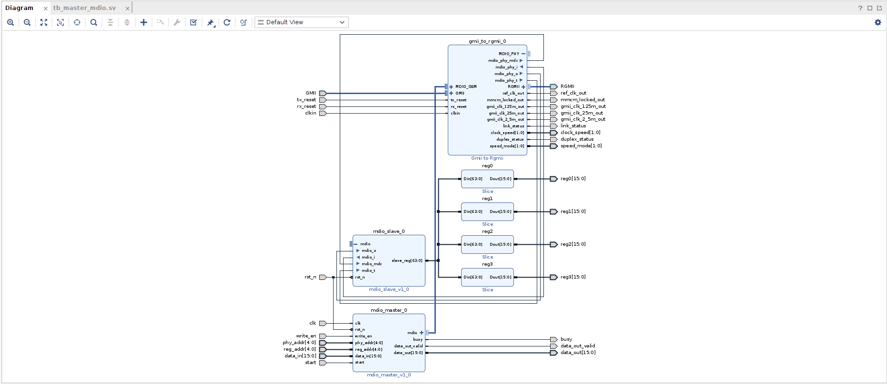
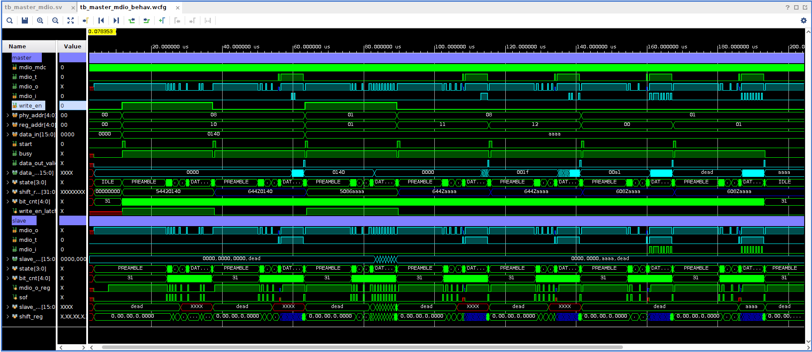

# Overview of the MDIO Master and Slave

#### MDIO Master (SystemVerilog)
- The `mdio_master` module is designed to communicate with a PHY (Physical Layer Device) using the MDIO (Management Data Input/Output) protocol. Key features include:
  - Inputs like `clk`, `rst_n`, `write_en`, `phy_addr`, `reg_addr`, and `data_in` for controlling MDIO transactions.
  - Outputs such as `mdio_mdc` (clock), `mdio_t` (tri-state control), and `mdio_o` (data output to the PHY).
  - The FSM (Finite State Machine) transitions through various stages like `IDLE`, `PREAMBLE`, `START_OF_FRAME`, `OPCODE`, `PHY_ADDR_PHASE`, etc., to handle both read and write operations.
  - The `mdio_master` initiates communication by asserting the `start` signal and proceeds to read or write data based on `write_en`.

#### MDIO Slave (SystemVerilog)
- The `mdio_slave` module responds to the MDIO master’s commands. Key features include:
  - Inputs such as `mdio_mdc`, `mdio_o`, `mdio_t`, and `rst_n`.
  - An output `mdio_i` sends data back to the master.
  - Internal FSM handles the MDIO protocol, with states like `PREAMBLE`, `START_OF_FRAME`, `OPCODE`, `PHY_ADDR_PHASE`, `REG_ADDR_PHASE`, `TURNAROUND`, `DATA_PHASE`, and `COMPLETE`.
  - The slave has an array of registers (`slave_reg`) to store data and perform read/write operations based on the master’s commands.
  
## MDIO Master-Slave System

This project implements a fully functional MDIO master-slave communication system using SystemVerilog. The master initiates and controls data transfers to and from a PHY device, while the slave responds to the master's commands. This system is tested with Xilinx’s GMII to RGMII core, which uses the MDIO interface for PHY management.

## Project Structure

1. **MDIO Master**:
   - **mdio_master.sv**: Implements an MDIO master to interface with a PHY device. The master supports both read and write operations, using a state machine to handle MDIO transactions.
   
2. **MDIO Slave**:
   - **mdio_slave.sv**: Implements an MDIO slave, which responds to the master's MDIO transactions. The slave contains a set of internal registers for storing and retrieving data.
   
3. **Project TCL Script**:
   - A provided TCL script automates the creation of a Vivado project that includes both the MDIO master and slave. This project can be synthesized and simulated for testing.

## Testbench Setup

The testbench verifies communication between the MDIO master, Xilinx PHY, and MDIO slave. It utilizes the Xilinx GMII to RGMII core’s MDIO interface, ensuring that both the master and slave work correctly within a real-world scenario.

### Test Environment:
```
testbench <---------> mdio-master <---------> xilinx-phy <---------> mdio-slave
```

This setup tests the full chain of MDIO transactions, with the MDIO master interfacing with the Xilinx PHY and the MDIO slave, validating the correctness of read and write operations.

## Usage

1. **Setting up the Project**:
   - Run the provided `.tcl` script in Vivado to create the test project.
   - The project will instantiate both the MDIO master and slave and connect them through Xilinx's GMII to RGMII core's MDIO interface.

2. **Simulating**:
   - Use Vivado’s simulation tools to verify the communication.
   - A waveform will be generated showing the MDIO clock (`mdio_mdc`), data lines (`mdio_o`, `mdio_i`), and state machine transitions.

3. **Synthesis**:
   - The project is ready for synthesis and deployment on FPGA.

## Testing

### Test Bench Flow:

1. **MDIO Write Operation**:
   - The MDIO master initiates a write to the slave’s register by specifying the PHY address, register address, and data to be written.

2. **MDIO Read Operation**:
   - The master sends a read command, and the slave responds with data from the requested register.

### Key Signals to Monitor:
- **MDC (Clock)**: The clock for the MDIO interface.
- **MDIO (Data)**: Bidirectional data signal between master and slave.
- **State Machine**: Transitions through states like `IDLE`, `OPCODE`, `DATA_PHASE`.

### Block Diagram Layout:


### Test Waveform:

